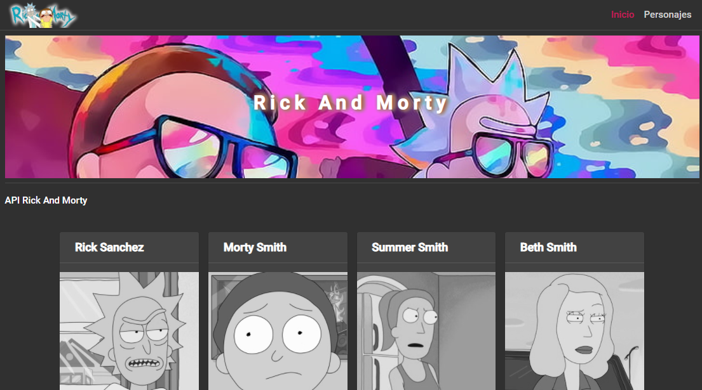
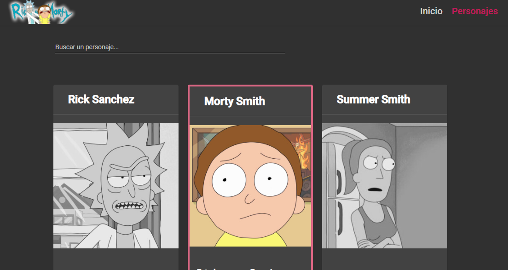
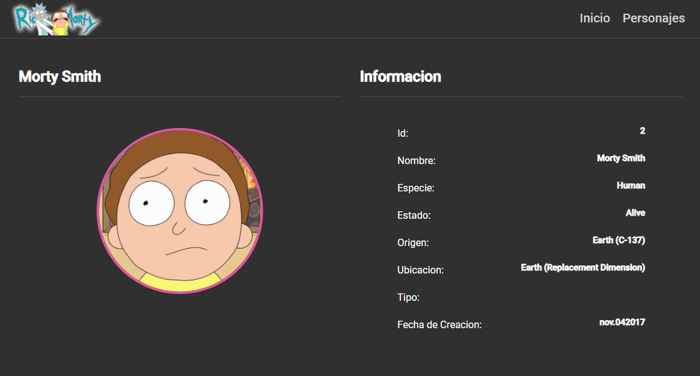
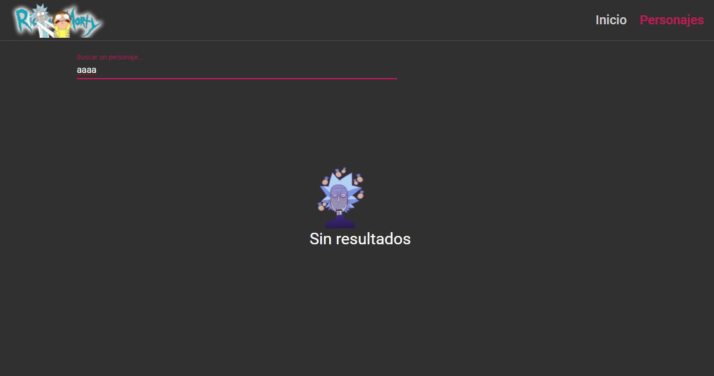

# API Rick && Morty, Angular Material

### Consumo de una API REST

Consumo de una API REST con el framework Angular, tecnologias usadas:

1. Angular Material.
2. Flex Layout. 
3. HttpClient.
4. Operadores RXJS 
5. Lazy Load.

### Capturas

#### Home

#### Personajes

#### Informacion del personaje

#### Control de errores

### Demo en netlify:
https://peaceful-mirzakhani-615c14.netlify.app
